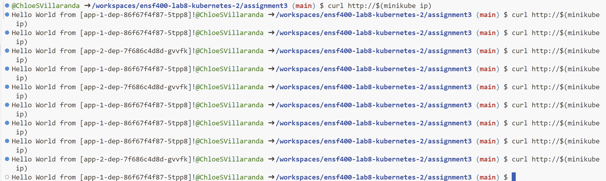

## Steps Taken
Here are the following steps, commands, and outputs:

### Initialization

```sh
minikube start
minikube addons enable ingress
```

### Deployment
Had to deply all .yaml files
```sh
kubectl apply -f nginx-dep.yaml
kubectl apply -f nginx-configmap.yaml
kubectl apply -f nginx-svc.yaml
kubectl apply -f nginx-ingress.yaml 
kubectl apply -f app-1-svc.yaml
kubectl apply -f app-1-ingress.yaml
kubectl apply -f app-1-dep.yaml
kubectl apply -f app-2-svc.yaml
kubectl apply -f app-2-ingress.yaml
kubectl apply -f app-2-dep.yaml
```

### Verification
Test the responses
```sh
curl http://$(minikube ip)
```

Here, I ran it 10 times to see if I can get a 70-30 split (or near that) between app 1 and 2. The following output is as follows:



